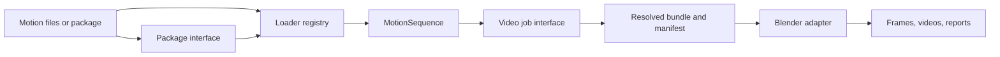

# Architecture

MotionViewer separates host-side planning from Blender execution so most behavior is fast and testable in CPython.

## Module map

| Module | Interface | Responsibility |
|---|---|---|
| `core` | domain values and pure functions | coordinates, skeleton semantics, layout, ground, palette |
| `loaders` | `MotionFormatRegistry` | detect and load motion files into `MotionSequence` |
| `packages` | functions exported by `motionviewer.packages` | inspect, validate, select, and materialize protocol packages |
| `video` | `RenderJob` and batch request types | resolve configuration, prepare bundles, launch adapters, encode output |
| `blender` | bundle-consuming entry points | create actors and scenes, retarget, stage cameras, render frames |
| `cli` | grouped Typer commands | translate command-line input into module calls |

The interface of each module is also its test surface. Blender-specific implementation stays behind a narrow process adapter; selection, validation, geometry math, and job preparation remain ordinary Python.

## Data flow and reproducibility

1. A loader produces a canonical `MotionSequence` with capabilities and coordinate metadata.
2. A `RenderJob` resolves relative paths, backend configuration, frame rate, frame range, camera views, and scene bounds.
3. MotionViewer writes a JSON bundle for Blender and a manifest containing the resolved job and input hashes.
4. Blender processes one staging group at a time. Multi-view jobs may run independent `world` and `inplace` groups in parallel.
5. Host-side encoding and overlays produce final media and append view outputs to the manifest.

Third-party systems sit at explicit seams: package stores have directory and tar adapters; Blender is an external process adapter; the SMPL-X addon and FBX characters are locally installed dependencies.
